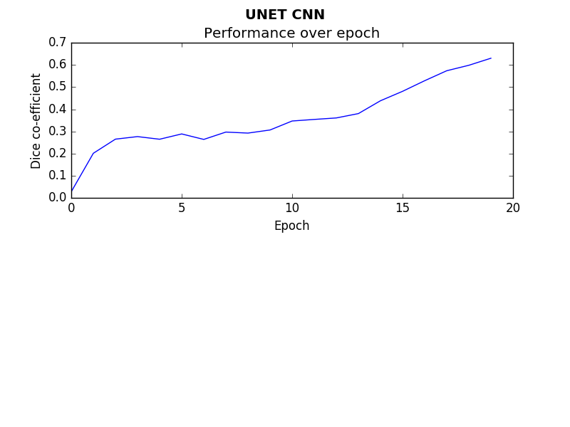

# Brachial Plexus segmentation of ultrasound by Convolutional neural network
Using Convolutional Neural Networks to automatically segment nerves from ultrasound images

## Abstract
Pain management through the use of indwelling catheters that block or mitigate pain source, is a promising alternative to narcotics, which bring on sevral unwanted side effects. Accurate identification of nerve structures in ultrasound images is a fundamental step in effectively inserting a catheter into a patient requiring pain management. In this paper, we look into [using a UNET convolutional neural network’s ability to segment the brachial plexus from an ultrasound image](https://arxiv.org/abs/1505.04597) of a patient, and compare it with a more traditional type of convolutional neural network performing the same segmentation task.

## Background
Pain control in post surgery settings is a priority for health care providers. In addition to keeping the patient comfortable, pain management has other benefits. Pain control can help speed recovery and may reduce the risk of developing certain complications after surgery, including blood clots and pneumonia. This is because, if pain is controlled, patients will be more able to complete tasks such as walking and deep breathing exercises.

The most common treatment of pain is the administration of narcotics. But these narcotics have a significant downside. These side effects include nausea, itching, and drowsiness. 

A promising alternative to pain control is creating a nerve block. Unlike an epidural which controls pain over a large region of your body, a nerve block controls pain in a smaller region of the body, such as a limb. The nerve block is created by placing a thin catheter in the appropriate nerve region. The main advantage of these nerve blocks is that they avoid the side effects caused by narcotics, as stated above.

Creating a nerve block is done by using a needle to place a small catheter in the appropriate region. The main challenge in doing so is isolating the appropriate insertion place. Current methods involve using an ultrasound in real time to identify a nerve structure such as the brachial plexus. This requires the knowledge of a highly trained radiologist, and even then, is error prone. For these reasons, a less manual, and more accurate approach is desired. 


A convolutional neural network (CNN) is a class of deep, feed forward artificial neural network that has been used successfully for analyzing visual imagery. They are inspired by biological processes represented within the visual cortex and in recent years, have demonstrated promise in medical image segmentation.

These networks are known to be shift and space invariant and can learn filters that were hand engineered in traditional algorithms. This independence from prior knowledge and human effort in feature design makes them an excellent candidate for an approach to auto- matic segmentation of nerves in ultrasound images.


In this paper, we explore using a convolutional neural networks (CNN) to segment these ultrasound images. A UNET structure is considered the strongest for medical images because it applies a fully connected convolutional network architecture in a way that [makes the most use out of limited data.](https://lmb.informatik.uni-freiburg.de/people/ronneber/u-net/)} We will tune parameters within the UNET and compare its  performance to a simple Segnet structure 

# Experimental Setup
For the task of segmenting MRI data using our convolution neural network, we needed to consider the training data, as well as the network infrastructure for training and prediction.

## The data
[A Kaggle competition in 2016](https://www.kaggle.com/c/ultrasound-nerve-segmentation) made available a large training set of black and white images where the Brachial Plexus (BP) nerve has been manually annotated in ultrasound images. The annotators were trained by experts and instructed to annotate images where they were confident about the existence of the BP landmark.. This data set includes images where the BP is not present, and as with any human-labeled data, will contain noise, artifacts, and potential mistakes from the ground truth. 

The total number of labelled examples within the Kaggle data is 5635. We split that data into 80 percent training, and 20 percent test examples. This results in 4508 training examples, and 1127 test examples. 


An ultrasound image which includes the unlabelled BP. To an untrained eye, spotting the Brachial Plexus is 


The human labelled mask for the ultrasound of the BP.


An ultrasound image where there is no BP. The resulting BP labelled mask will contain no segmented data.

## CNN Implementation libraries
In order to build the different convolutional neural networks used to segment the ultrasound images, we wanted to use a high-level neural network API that enabled fast experimentation. The [Keras API library](https://keras.io/) is one such solution, and the one we chose. Keras is written in Python and is capable of running on top of TensorFlow - an open source software library for numerical computation using data flow graphs. Keras and TensorFlow support both convolutional networks and runs seamlessly on CPU and GPU.

Experiments were run using an Amazon EC2 instance with a GPU using cuDNN - a deep neural network GPU accelerated library. This approach is much faster than a typical CPU because of the parallel computation it was designed form,

## 2 Dimensional U-NETdesign
The U-Net is a network design that relies on strong use of data augmentation to maximize the effect of the available annotated samples without overfitting the model. The architecture contains a contracting path which captures context and a symmetric expanding path that enables precise localization. It is called a "U-net" because of it's "U" shaped network structure.


The high level basic U-Net architecture. The network gets its name from its U shape.

As seen above, the U-Net network takes a raw image as input and outputs an output segmentation map. 
It's overall architecture is illustrated above. Like any convolutional neural network, it consists of a number of small operations, each of which corresponding to a small arrow. The image file is input into the network and the propagated through the network along all possible paths,  and at the end, the ready segmentation map is output.

Each blue box corresponds to a multi channel feature layer. Most of the operations are convolutions followed by a non-linear feature activation. 

Below is a diagram detailing one of the first convolution layer. The layer contains a standard 3X3 convolution followed by a non-linear activation function. By design, only the valid part of the convolution is used, which means that for a 3X3 convolution, a 1 pixel border is lost. This allows large images to be processed in smaller tiles. 	


Convolution layer. Note that this diagram illustrates a 3X3 convolution layer with 3 channels. Since our ultrasound images are black and white, we will only be convolving 1 channel.


Max pooling operations as seen below are illustrated with down arrows in the architecture diagram. It reduces the x, y size of the feature map. This max pooling operation operates on each channel separately.  This simply propagates the maximum activation from each 2X2 window to the next feature map. After each max pooling operation, the number of feature channels are increased by a factor of 2. All in all, these convolution and pooling operations gradually increase the ``what" and decrease the ``where." In other words, it is able to identify shift and space invariant features. 


Finally, after these contraction operations, expansion operations are performed to create a high segmentation map of the same resolution as the original image.  	


The following is the Python code used to create the UNET. 


Creating the UNET using Keras and Tensorflow.

A Dice coefficient (also known as Sorensen Index) is used as a loss function. The index is intended to be applied as an indicator of presence / absence of data, and over all, is a statistic used to compare the similarity of two samples. In this case, the samples are the prediction output, and the ground truth of the segmented pixels. The dice coefficient is calculated as follows.


A more illustrative diagram of how a U-Net is constructed for the segmentation of a medical image is seen below. 


A U-Net architecture in a more abstract form. The actual number of feature maps illustrated is symbolic. The green arrows do un-sampling and black ones keep the original size of input, while arrows marked red are blocks of layers that down-sample their input. The cyan arrows are long skip connections which concatenate feature maps from the first stage to feature maps in the second stage. This results in the expanding path having access to twice as many features as the contracting path.

# Results
The results for each experiment used the dice coefficient as a measure of accuracy. This is appropriate since it is a good statistic for measuring the similarity between the predicted BP pixels, and the ground truth BP pixels according to the training masks. 

For each experiment, the training examples were randomly split. 80 percent were reserved for training, and the remaining 20 percent for testing the performance of the resulting model.

After the model has been trained, a mask is created for each test image. Examples of such masks are seen below.


An example of a resulting image segmentation. For the purposes of illustration, the area inside the red circle is the area that has been segmented as the BP


A second example of the BP segmentation.


A third example of a BP segmentation.

## Basic UNET
A basic UNET architecture as described in the 2 Dimensional UNET section above was used first. As with all experiments, the Kaggle training data was split into 4508 training examples (80 percent) and 1127 test examples (20 percent).  The CNN was trained against the training set and the its performance measured using the test examples. 

For our initial UNET architecture, a DCF of 0.63 is achieved after 20 epochs of training with batch sizes of 32. 



The learning curve over 20 epochs of training for a CNN with a basic UNET architecture.

## UNET with data augmentation
Although a strength of UNET architectures is their supposed ability to perform accurately with minimal training data, we wanted to see how augmenting the training examples would effect the results. Doing so would theoretically allow the network to learn invariance to deformations without seeing them in the segmentation training data. In biomedical segmentation, this is important, since deformation used to be the most common variation in tissue and these deformations can be simulated efficiently. 

Keras was used to apply transformations in the following manner:

```python
datagen = ImageDataGenerator(
    featurewise_center=True,
    featurewise_std_normalization=True,
    rotation_range=20,
    width_shift_range=0.2,
    height_shift_range=0.2,
    horizontal_flip=True)
```

The descriptions for the augmentation variables are as follows:
- rotation_range = Degree range for random rotations.
- width_shift_range =  Range for random horizontal shifts. (fraction of total width). 
- height_shift_range = Range for random vertical shifts. (fraction of total height).
- shear_range = Shear Intensity (Shear angle in counter-clockwise direction as radians)
- zoom_range = Range for random zoom.
- featurewise_std_normalization = Divide inputs by std of the dataset, feature-wise.
- featurewise_center = Set each sample mean to 0.
- horizontal_flip = Randomly flip inputs horizontally.

With data augmentation, the DCF improves only slightly to 0.67. This is somewhat surprising that transforming and augmenting the training data had such little effect.


The learning rate when augmenting the image data using Keras data augmentation abilities over 20 epochs of training.

# Segnet
As stated before, a UNET architecture is generally considered to be the most appropriate architecture for medical images because of the ability to make accurate predictions with relatively low volumes of training data. So we wanted to compare the results with a more basic fully connected convolutional neural network. A basic Segnet architecture was used for our training purposes. It is not the intention of this paper to go into depth about the structure of a Segnet. More information can be found on the subject in other papers such as "SegNet: A Deep Convolutional Encoder-Decoder Architecture for Image Segmentation."  However, it is worth giving a very basic description of a SegNet. 

A novelty of SegNet  is the way in which the decoder upsamples its lower resolution input feature maps. The decoder uses pooling indices computed in the max-pooling step of the corresponding encoder to perform upsampling. By doing so, the need for learning to upsample is removed. The resulting upsampled maps are then convolved with trainable filters producing dense feature maps. 


The architecture of a Segnet architecture.

Credit to Divam Gupta for providing [Keras code to implement the Segnet](https://github.com/divamgupta/image-segmentation-keras). With no data augmentation, the Segnet architecture was able to score a DCF of 0.60 after training of 20 epochs. This is quite close to the UNET architecture which was somewhat surprising. The reason that they may be close is likely in the fact that the training data is actually quite significant in this challenge mitigating the supposed strength of the UNET.


Accuracy using a Segnet architecture is comparable to a UNET architecture.

## UNET with only 100 training examples
To further test the idea that the UNET architecture remains performant on minimal data, we decreased the test data too 100. The original UNET paper experimented using only 30 512X512 images of electron microscopic recordings. So our 100 seems generous. 

However, with only 100 training examples, our U-Net performance was incredibly poor. It's dice coefficient dropped to 0.0113 after the 20th epoch.

## UNET with different sizes
The fact that the UNET performed so poorly given 100 training examples is somewhat surprising, given it's supposed strengths. With 4509 training examples, our UNET performed well, but at 100, it performed very poorly. This inspired a set of experiments testing the UNET at with training sets of sizes between these two extremes to see where the performance started to become acceptable. 

The UNET was trained with training sizes of 100, 750, 1250, 2500, and 4509 and it's performance characteristics plotted accordingly. 


Accuracy of  the UNET with differing amounts of training data and no data augmentation. Final performance is quite good with 4508 data examples. With only 100 training examples, it's very poor. 

As you can see, the UNET starts to performs very poorly with small amounts of data. This is surprising given that a UNETs supposed strength is it's performance with minimal data.

# Conclusions
When using the entire training set, results from the UNET architecture are promising and demonstrate it's strengths in medical image segmentation. It outperformed a competitive network architecture - the Segnet. Without having tried all of the competitive network architectures, we can not conclude that the UNET is the best architecture for the task of nerve segmentation of ultrasounds, but it is fair to conclude its promise. 

A second conclusion involves the amount of training examples used for a UNET. Given small amounts of training data, the UNET didn't perform well at all. The original UNET paper demonstrated it's ability to perform well using just 30 training images. But our network performed very poorly with over 10 times more training examples than what was used in the original paper. This was unexpected, but demonstrates the difference between image types. Ultrasound images are notorious for containing more noise, so perhaps require much more training examples than if the images were electronic microscopic recordings. So we can conclude that while the UNET may perform well with limited training examples, it doesn't perform well in all settings. The nature of the images matters a lot.

# Future work
Our experiments showed a best DCF score of 0.67, which is significantly lower than the best score during the Kaggle competition which was 0.73226. Part of this is because entries of the competition used all 100 percent of the examples to train the model, whereas we had to reserve 20 percent of our data for test. That said, we don't expect that using the entire data set for training would have resulted in the best score for the competition. So there would still be lots of future work left to bring our UNET to a best in class structure. 

The main purpose of this research wasn't necessarily to create the best performance on this segmentation task. It was to assess the appropriateness of a UNET architecture for this segmentation task. While we demonstrated it's promise, we can't conclude it's the leader until we test it against all other competitive architectures. The list of competitive networks isn't short; just some of the other networks include:

- Fully Convolutional Network 8, 16, 32
- Fully Convolutional DenseNet
- Mask R-CNN
- PSPNet
- RefineNet
- G-FRNet
- DecoupleNet
  
In addition to trying other network structures, one could attempt to tune the parameters of each network in many different ways including:
- Changing the resolution of the images. Instead of 64X80 for example, you could try 80X112
- Attempting other data augmentations including elastic transforms. 
- Likely many more. I don't pretend to be an expert with tuning CNNs.
